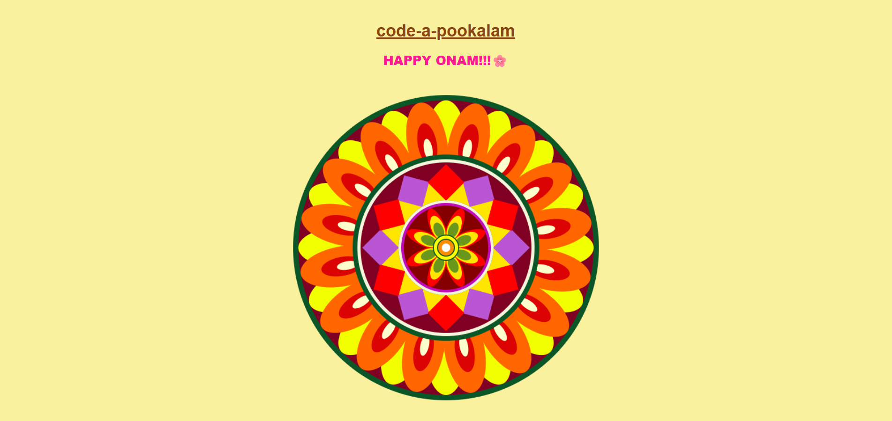

# Code-A-Pookalam 🌸
Welcome to CODE-A-പൂക്കളം, a creative coding challenge scheduled from September 1–6, where tradition meets technology! 🌼

### Your Details
- LAYANA SANOJ -CSE2-S1

### Hosted Pookalam Link

https://layana-sanoj.github.io/code-a-pookalam/

### Pookalam Description
The design of this Pookalam has many layers of simple shapes like petals, diamonds, and circles arranged in a circle. The colors are bright and happy, with orange, red, yellow, purple, and green. These colors make the design look lively and festive. Each layer has different colors that stand out but also look good together. The colors and shapes show the joy of Onam in a clean and modern way.

### Technologies Used 
HTML,CSS and JS

### Video explaining How you build the pookalam

[

### Screenshots

[

Happy Onam !  
Made with ❤️ at TinkerHub LBSITW
